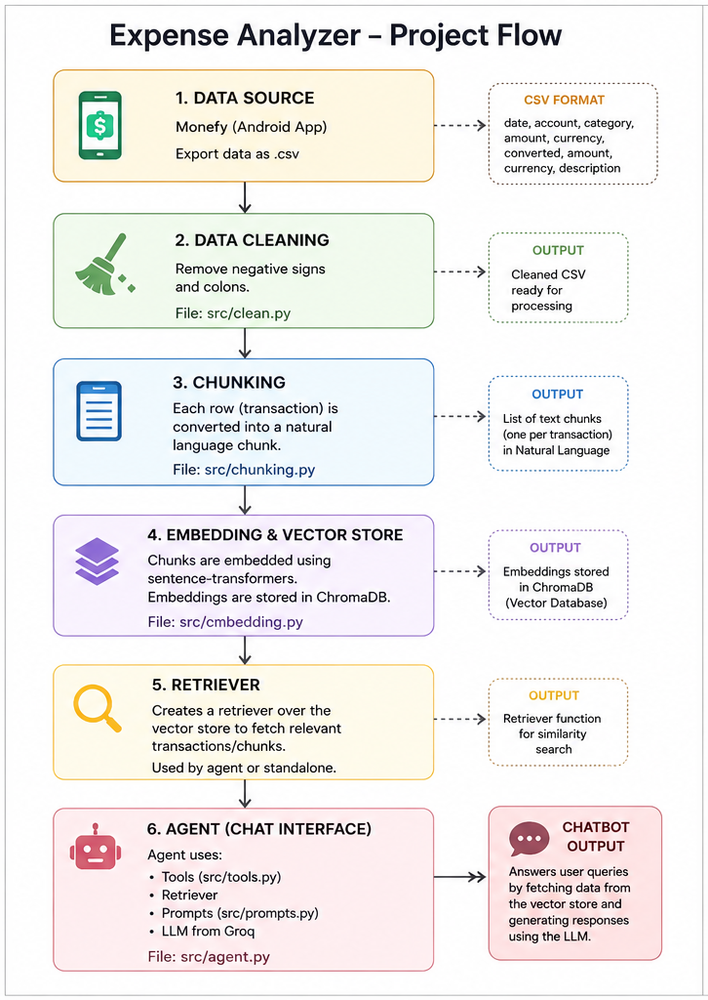

# Expense Analyzer

An AI-powered expense analysis chatbot that lets you interact with your personal financial data using natural language.

Instead of manually filtering spreadsheets, you can simply ask questions like:

- "How much did I spend on food last month?"
- "What were my biggest expenses in June?"
- "How much did I spend on fuel this year?"
- "Show all transactions related to Amazon."

The project uses Retrieval-Augmented Generation (RAG) by converting expense transactions into semantic embeddings stored in ChromaDB. Relevant transactions are retrieved and passed to an LLM to generate accurate responses.

---

## Project Flow

<p align="center">
    
</p>

---

# Features

- Import expense data exported from **Monefy**
- Automatically clean transaction data
- Convert every transaction into natural language
- Generate semantic embeddings using Sentence Transformers
- Store embeddings in ChromaDB
- Retrieve relevant transactions using semantic similarity
- AI chatbot powered by Groq LLM
- Tool-based agent architecture using LangChain

---

# Tech Stack

- Python
- LangChain
- ChromaDB
- Sentence Transformers
- Groq LLM
- Pandas

---

# Project Architecture

```
Monefy CSV
      │
      ▼
Data Cleaning
(src/clean.py)
      │
      ▼
Natural Language Chunking
(src/chunking.py)
      │
      ▼
Embedding Generation
(src/embedding.py)
      │
      ▼
ChromaDB Vector Store
      │
      ▼
Retriever
(src/retriever.py)
      │
      ▼
AI Agent
(src/agent.py)
      │
      ▼
Chatbot Response
```

---

# Dataset

The project currently uses expense data exported from the **Monefy** Android application.

Each CSV contains fields similar to:

| Column |
|----------|
| Date |
| Account |
| Category |
| Amount |
| Currency |
| Converted Amount |
| Converted Currency |
| Description |

---

# Pipeline

## 1. Data Cleaning

File:

```
src/clean.py
```

The exported CSV is cleaned before further processing.

Current preprocessing includes:

- Removing negative signs
- Removing colons
- Formatting transaction fields

Output:

Cleaned CSV ready for processing.

---

## 2. Chunk Generation

File:

```
src/chunking.py
```

Every transaction is converted into a natural language document.

Example:

```
On 12 June 2025,
I spent ₹350 on Food
using my SBI Account.

Description:
Lunch at Domino's.
```

Each transaction becomes one semantic chunk.

---

## 3. Embedding Generation

File:

```
src/embedding.py
```

Each chunk is embedded using Sentence Transformers.

The embeddings are stored inside **ChromaDB** for efficient similarity search.

---

## 4. Retriever

File:

```
src/retriever.py
```

Creates a retriever over the Chroma vector database.

It returns the most relevant expense records for a user query.

Example query:

> How much did I spend on groceries in May?

The retriever finds the most relevant transactions before sending them to the LLM.

---

## 5. AI Agent

File:

```
src/agent.py
```

The chatbot is implemented as a LangChain agent.

The agent uses:

- Retriever
- Custom tools
- Prompt templates
- Groq LLM

Prompt templates are stored in:

```
src/prompts.py
```

Tools are defined in:

```
src/tools.py
```

---

# Project Structure

```
expense-analyzer/

│
├── data/
│
├── chroma_db/
│
├── src/
│   ├── clean.py
│   ├── chunking.py
│   ├── embedding.py
│   ├── retriever.py
│   ├── tools.py
│   ├── prompts.py
│   ├── agent.py
│   └── main.py
│
├── plan.png
├── requirements.txt
├── .env
└── README.md
```

---

# Installation

Clone the repository

```bash
git clone https://github.com/MorisTakhellambam/expense-analyzer.git

cd expense-analyzer
```

Install dependencies

```bash
pip install -r requirements.txt
```

---

# Environment Variables

Create a `.env` file.

Example:

```env
GROQ_API_KEY=your_api_key
```

---

# Usage

## Step 1

Export your expense history from the Monefy Android app.

---

## Step 2

Clean the data.

```bash
python src/clean.py
```

---

## Step 3

Generate transaction chunks.

```bash
python src/chunking.py
```

---

## Step 4

Generate embeddings and populate ChromaDB.

```bash
python src/embedding.py
```

---

## Step 5

Start the chatbot.

```bash
python src/agent.py
```

---

# Example Questions

- How much did I spend this month?
- What is my biggest expense category?
- Show all transactions related to Amazon.
- How much did I spend on food in April?
- Which account do I use the most?
- What are my top five expenses?
- How much did I spend on transportation?
- Show expenses made using my credit card.

---

# Future Improvements

- Expense forecasting using machine learning
- Monthly spending trend visualization
- Budget recommendation agent
- Automatic expense categorization
- Receipt OCR support
- Multi-user support
- Streamlit web interface
- SQL + Vector hybrid retrieval
- Financial insights dashboard

---

# License

This project is licensed under the MIT License.
